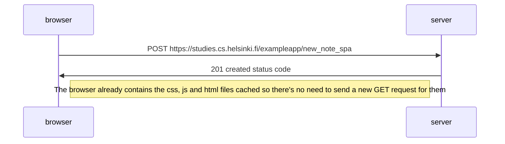

```mermaid
sequenceDiagram
    participant browser
    participant server

    browser->>server: POST https://studies.cs.helsinki.fi/exampleapp/new_note_spa
    server->>browser: 201 created status code

    Note right of browser: The browser already contains the css, js and html files cached so there's no need to send a new GET request for them
```